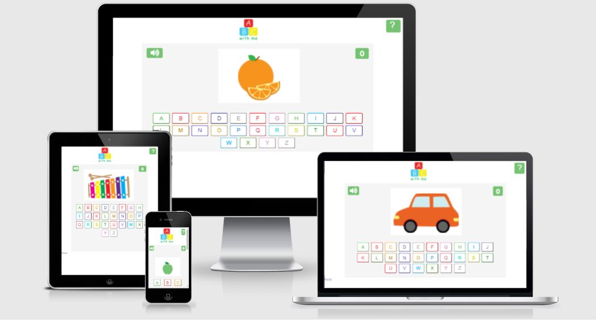
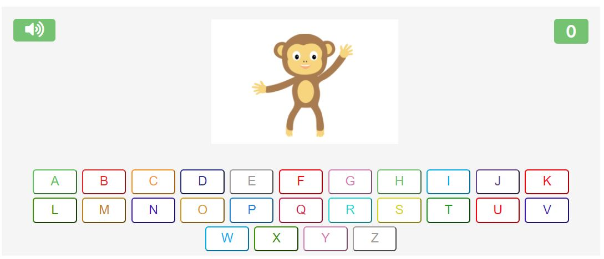
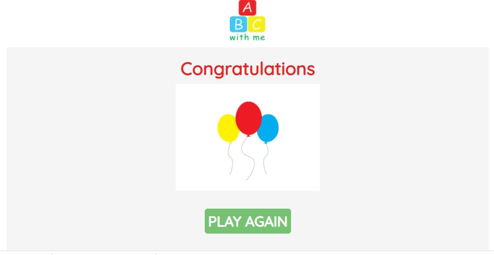
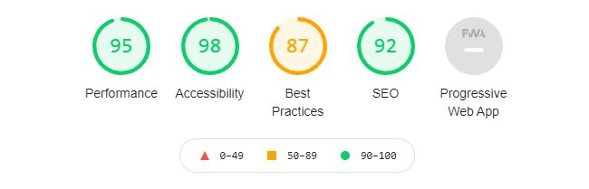
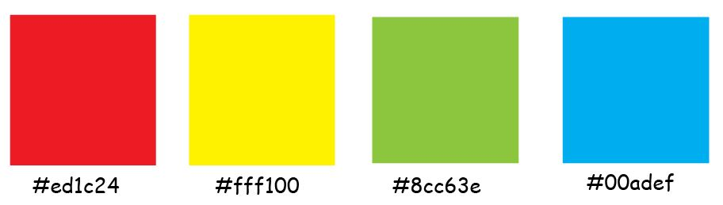
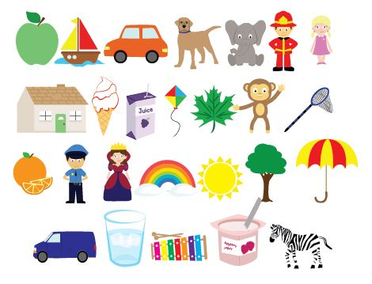
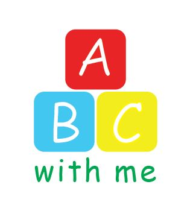

<h1 align="center">ABC With Me</h1>

ABC With Me is an interative alphabet game aimed at preschoolers. Most english speaking children aged 3 + have been introduced to the alphabet in some form and although they might know the alphabet song most children of that age dont know what the alphabet letters look like. 

ABC With Me shows the player a fun illustration. Once the user clicks the sound button they will hear me telling them what the picture is and which letter the illustration starts with. The user should then pick the correct letter. If the user chooses the right letter they will hear me saying well done and another illustration will appear on the screen. If the user chooses the wrong letter they will hear me saying try again and the score/ illustration will remain the same until they choose the right letter.

live link https://deecooper.github.io/abc-with-me/

<h2> Feature </h2>

### Header

The header is provided at the top of the game. The ABC With Me logo and instructions button are nested in the header. The ABC With Me logo is placed in the center and the instructions button is placed to the right of the screen.

### Game container

The game container area is where the user plays the game. The image container is nested in the game container div. The alphabet buttons are also nested in the game container area. The button for the audio is placed to the left of the game container and the score is placed to the right.

### Game Finished page

When the player reaches the score 20 they will be brought to the Game finished page. The game finished page has a button to restart the game if the player wishes to do so.

<h2> Target Audience </h2>

- Preschoolers aged 3-5
- Children of any age who have difficulty learning the alphabet
- Parents and their children

<h2> Testing </h2>

### Wc3 Validator / Jshint
ABC with me has been tested on W3C HTML validator, WC3 CSS Validator and Jshint. The finial testing was carried out on Wc3 Validator HTML and CSS and showed no errors. 

Jshint feedback

There are 13 functions in this file.

Function with the largest signature take 1 arguments, while the median is 0.

Largest function has 11 statements in it, while the median is 3.

The most complex function has a cyclomatic complexity value of 2 while the median is 1.

14 warnings
19	'let' is available in ES6 (use 'esversion: 6') or Mozilla JS extensions (use moz).
20	'let' is available in ES6 (use 'esversion: 6') or Mozilla JS extensions (use moz).
21	'let' is available in ES6 (use 'esversion: 6') or Mozilla JS extensions (use moz).
25	'let' is available in ES6 (use 'esversion: 6') or Mozilla JS extensions (use moz).
178	'let' is available in ES6 (use 'esversion: 6') or Mozilla JS extensions (use moz).
192	'let' is available in ES6 (use 'esversion: 6') or Mozilla JS extensions (use moz).
193	'let' is available in ES6 (use 'esversion: 6') or Mozilla JS extensions (use moz).
196	'let' is available in ES6 (use 'esversion: 6') or Mozilla JS extensions (use moz).
200	'let' is available in ES6 (use 'esversion: 6') or Mozilla JS extensions (use moz).
211	'let' is available in ES6 (use 'esversion: 6') or Mozilla JS extensions (use moz).
223	'let' is available in ES6 (use 'esversion: 6') or Mozilla JS extensions (use moz).
234	'let' is available in ES6 (use 'esversion: 6') or Mozilla JS extensions (use moz).
245	'arrow function syntax (=>)' is only available in ES6 (use 'esversion: 6').
249	'let' is available in ES6 (use 'esversion: 6') or Mozilla JS extensions (use moz).

### Lighthouse
I tested my game on Lighthouse using dev tools

 

### Other testing

My three and half year old son tested this game. I showed him which button to press and went through the alphabet with him. He enjoyed the illustrations and the audio. 

ABC With Me was tested on different size screens using the website Responsinator (http://www.responsinator.com/?url=https%3A%2F%2Fdeecooper.github.io%2Fabc-with-me%2F)
and Dev tools on Chrome. The game is responsive on all screen sizes.

I tested the game on Google Chrome and Internet Explorer.

<h2> Design </h2>

### Colours

As this game is aimed at young children I wanted to create a fun colourful interface.

The main colours used in this game are shown below.
I choose red, blue and yellow as they are the primary colours. I also used green for the buttons and the logo text. Children are attracted to bright colours I kept this in mind whilst creating my game.

I created all of the illustrations myself using Abobe Illustrator.

I created the ABC logo in Adobe Illustrator.

For the main typography I used Google fonts Quicksands as it is a simple clear font for users.

<h2> Audio </h2>

I recorded all of the audio myself I added background sounds to alert the user when they have got the answer right or wrong. I got the background sounds from Freesound.org link: https://freesound.org/

<h2>User Testing </h2>

### As a user I want to be able to

- Play a learning game thats fun and interactive
- Find a clear explanation of how to play the game
- Track my progress
- Win the game and easily play again

<h2>Credits</h2>

My mentor Antonio Rodriguez helped me throughout. He helped me with the array and objects containing the images audio and answers. He also helped me with my Event listeners and time out functions.

Niall Maher Senior Software Developer

Niall Maher helped me to filter out my used illustrations once they have been answered correctly using the filter item method.

I used the document.addEventListener("DOMContentLoaded", function () from the Love Maths Game.

<h2>Deployment</h2>

I deployed the game to Github pages and a live link to the website was provided. 
The deployment steps are:
1.	Log into git Hub
2.	Locate the specific repository
3.	Select the settings link
4.	In the settings scroll down to pages
5.	Under the source heading select the dropdown menu and select main.

